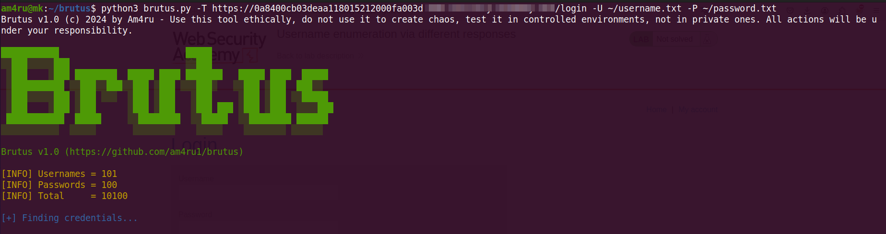
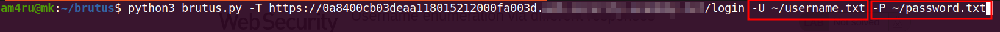
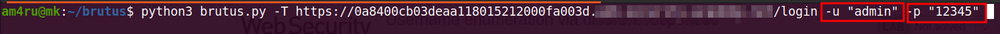
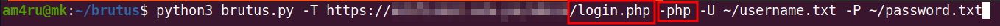
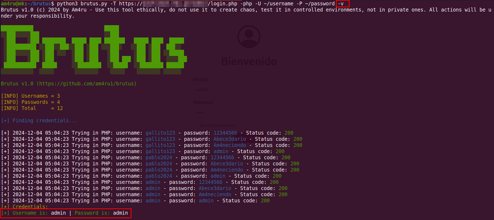
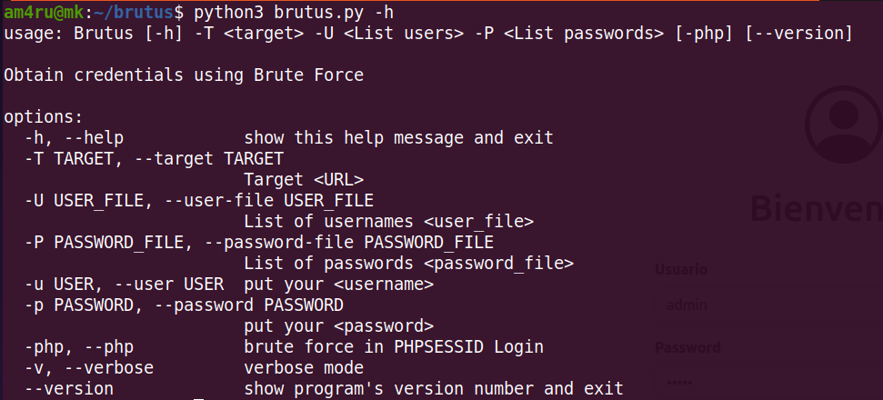

# Brutus

 
	

Herramienta para realizar ataques de fuerza bruta sobre el protocolo HTTP o HTTPS.

Puedes sentirte libre de utilizar diccionarios o entradas manuales.

**IMPORTANTE** : Siendo esta la primera versión, se tomá en consideración valores por defecto como las **COOKIES** ('session' o PHPSESSID), como también los atributos del formulario de logueo ('username' y 'password').

    

¿Cómo funciona?
======
La herramienta comienza  obteniéndo argumentos como son la URL, usernames y passwords siendo estos 2 últimos valores manuales o por uso de diccionarios.

    

    

Si se llegará a dar el caso donde estamos frente a una aplicación hecha en PHP deberás colocarar las FLAGS correspondientes -php o --php.

    

Puedes utilizar la opción verbose (-v, --verbose) para tener a detalle el proceso de autenticación.

    

Si debesea recibir ayuda puedes usar la opción help (-h o --help) para ver las FLAGS disponibles

    

Requisitos
======
Para tener un correcto funcionamiénto de la herramienta asegurate que cuentes con el intérprete de Python en un versión posterior a 3.6.
Si deseas cancelar la ejecución de la herramienta solo presiona Ctrl + C y estarás fuera.
